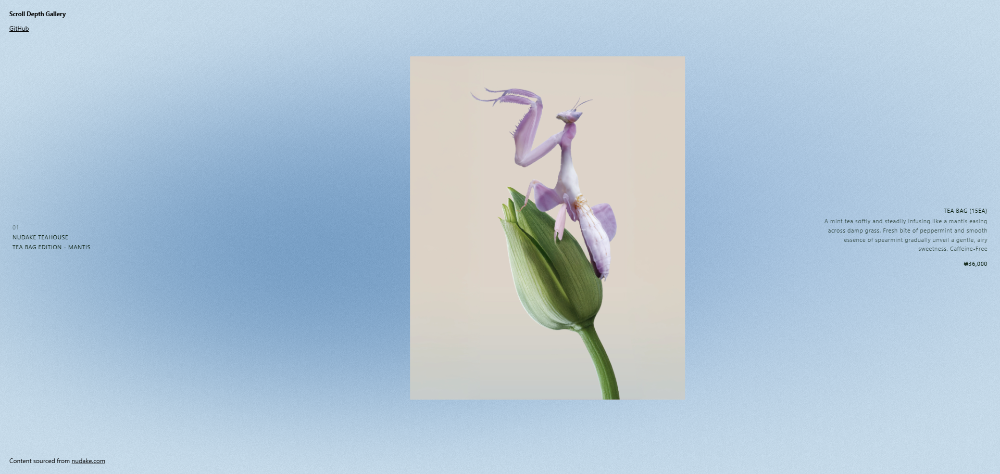

# 🌿 Scroll-Reactive 3D Gallery

> A scroll-driven WebGL gallery — depth-layered images, mood-based backgrounds, and velocity-reactive motion.

[🔗 Live Demo](https://scroll-depth-gallery.netlify.app/)

---

## Features
- Depth-layered image planes stacked along the Z-axis
- Mood-based background that shifts per image
- Velocity-reactive breath, tilt, and drift on scroll
- Pointer parallax with depth influence per plane
- Product label overlay with brand info and description

## Tech Stack
- **Three.js** — 3D rendering (via CDN importmap)
- **GLSL** — Shader backgrounds
- **JavaScript (ES Modules)**

## Reference
Inspired by [Atmospheric Depth Gallery](https://tympanus.net/codrops/2026/03/09/building-a-scroll-reactive-3d-gallery-with-three-js-velocity-and-mood-based-backgrounds/) by Houmahani Kane on Codrops